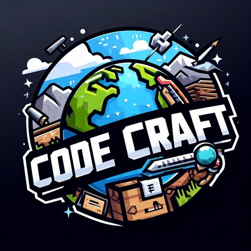

<h1 align="center"> Mods CodeCraft </h1>

<div id="header" align="center">
      
</div>

Para conseguir jogar, você deve baixar o Forge para a versão 1.20.1! Importante que seja a versão 47.3.0 do Forge!!!

Download do forge: 
```ssh
https://files.minecraftforge.net/net/minecraftforge/forge/index_1.20.1.html
```


## Como adicionar os mods
- ## Dowmload mods
    - Abrir o TLauncher:

        - Inicie o TLauncher no seu computador. 
        
    - Configurar a Versão do Minecraft:

        - No menu principal do TLauncher, clique no menu suspenso ao lado do botão "Install".
        - Selecione a versão do Minecraft compatível com o modpack que você baixou (por exemplo, Forge 1.20.1).

    - Instalar a Versão do Forge:

        - Clique em "Install" para instalar a versão do Forge correspondente.
        
    - Adicionar os Arquivos do Modpack:

        - Após a instalação do Forge, clique em "Folder" para abrir a pasta .minecraft.
        - Copie as pastas mods, config, e outros arquivos do modpack para a pasta .minecraft.

- ### Iniciar o Modpack
    - Iniciar o Minecraft com o Modpack:
        - Volte ao TLauncher.
    -   Selecione a versão do Forge que você instalou anteriormente.
    Clique em "Enter the game" para iniciar o Minecraft com o modpack instalado.

    - Verificar a Instalação
        - Após o Minecraft iniciar, verifique se os mods do modpack estão carregados corretamente.
        Acesse o menu de mods no jogo para confirmar.

## Requesitos minimos 
- 4Gb Ram dedicada para o minecraft

## Requesitos Recomendados

- 8Gb Ram dedicada para o minecraft
